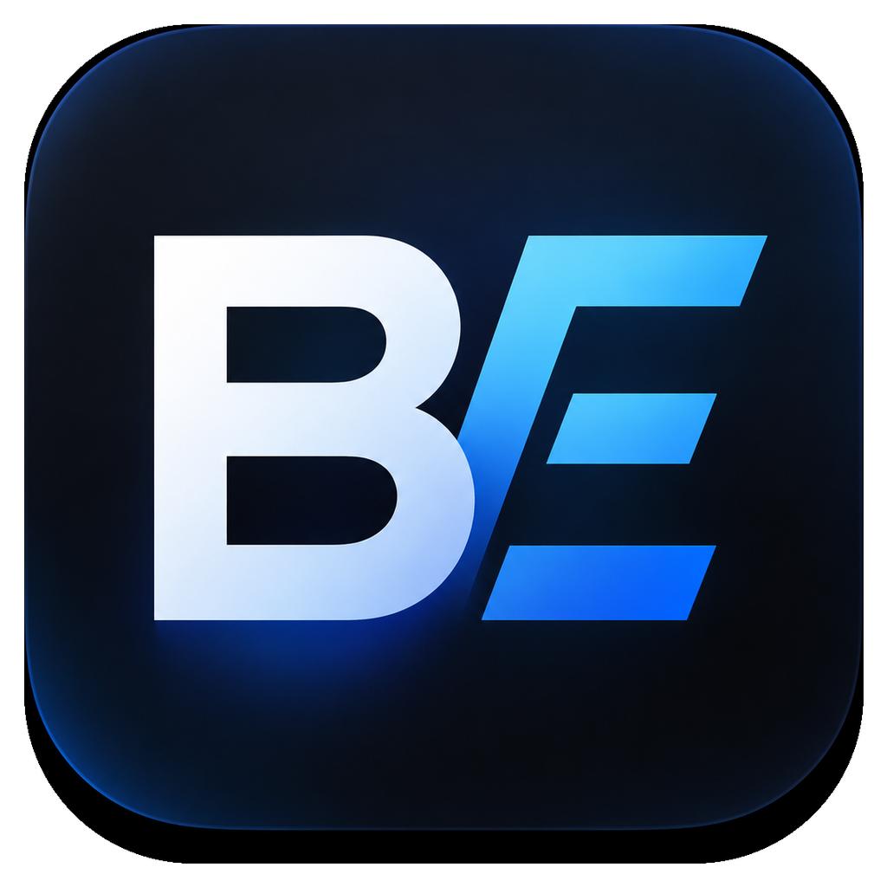

#  BslEdit

Инструменты для разработчиков 1С: просмотр и правка модулей, визуальный показ
форм и макетов так, как они выглядят в конфигураторе, отчёты проверок кода и
«глаза» и руки для AI-агентов. Без запуска 1С и без интернета.

## Инструменты

| | Что это | Кому |
|---|---|---|
| **[BSLView](guide/bslview.md)** | Плагин Total Commander: F3 на модуле, форме, макете, объекте метаданных или отчёте SARIF | Тем, кто живёт в Total Commander |
| **[BSLEdit](guide/bsledit.md)** | Автономный редактор с тем же интерфейсом | Для быстрой правки без IDE |
| **[1C Form Viewer для VS Code](guide/vscode.md)** | Превью форм и макетов рядом с XML, просмотр и правка форм и макетов из VS Code Chat | Тем, кто работает в VS Code |
| **[1C Form Viewer MCP](guide/mcp.md)** | MCP-сервер: агент видит и правит формы, делает снимки, собирает макеты из Excel | Claude Code, Cursor, Codex и другим агентам |

## Возможности

**Модули и запросы.** Подсветка BSL, OneScript и языка запросов в цветах
конфигуратора, панель процедур с областями, форматирование, безопасное
сохранение с сохранением кодировки. Светлая и тёмная тема.

**Формы.** `Form.xml` из выгрузки конфигурации показывается как в
конфигураторе: командные панели, группы, вкладки, таблицы, картинки. Инспектор
элемента с типом и путём к данным, переход от события к обработчику в модуле,
поиск по форме, снимок в PNG.

**Объекты метаданных.** XML объекта показывается как окно объекта в
конфигураторе: реквизиты, табличные части, формы и макеты с типами, связи
объекта по всей конфигурации и роли с правами на него. Формы, макеты и модули
открываются двойным щелчком в том же окне.

**Макеты.** `Template.xml` и `.mxl` — сеткой, с областями, параметрами,
рамками и картинками.

**Правка форм агентом.** AI-агент добавляет, переносит и удаляет элементы
формы, меняет их свойства, реквизиты и команды формы, проверяет форму на
ошибки — и сразу видит результат в превью.

**Макеты из Excel.** AI-агент превращает `.xlsx` в `Template.xml`, размечает
области и параметры, настраивает оформление и печать — и сразу показывает
результат.

**Отчёты SARIF.** Замечания bsl ls и bsl-analyzer — деревом по объектам или
правилам, с русскими названиями и переходом к строке.

## Что где работает

| | BSLView | BSLEdit | VS Code | MCP |
|---|:-:|:-:|:-:|:-:|
| Подсветка 1С, панель процедур, правка | ✓ | ✓ | — | — |
| Визуальные формы и макеты | ✓ | ✓ | ✓ | ✓ |
| Инспектор, переход к обработчикам | ✓ | ✓ | — | — |
| Объекты метаданных, связи и роли | ✓ | ✓ | — | — |
| Отчёты SARIF | ✓ | ✓ | — | — |
| Снимки форм | ✓ | ✓ | через Chat | ✓ |
| Правка форм агентом | — | — | через Chat | ✓ |
| Макеты из Excel и их правка | — | — | через Chat | ✓ |

## Установка

Всё скачивается со страницы [Releases](https://github.com/alonehobo/BslEdit/releases).

| Файл | Инструмент | Как установить |
|---|---|---|
| `BSLView.zip` | Плагин Total Commander | Открыть архив в Total Commander |
| `BSLEdit.zip` | Редактор | Распаковать и запустить `BSLEdit.exe` |
| `1c-form-viewer-vscode-*.vsix` | VS Code | Marketplace: **1C Form Viewer** или Install from VSIX |
| `1c-form-viewer-native-*-win-x64.zip` | MCP-сервер | Распаковать и [подключить к агенту](guide/mcp.md#подключение) |

Требования: Windows 10/11 и WebView2 Runtime (обычно уже установлен). MCP-серверу
нужен Edge или Chrome.

Что нового в последней версии — [Releases](https://github.com/alonehobo/BslEdit/releases).

## Разработка

Сборка, тесты и выпуск релиза — в [DEVELOPMENT.md](DEVELOPMENT.md).

## Благодарности

- [Monaco Editor](https://microsoft.github.io/monaco-editor/) — редактор (входит в поставку)
- [bsl_console](https://github.com/salexdv/bsl_console) — цветовая схема подсветки
- [CDT 41](https://github.com/lekot/VScodePluginFor1CDev) (MIT) — идея визуального макета форм
- [cc-1c-skills](https://github.com/Nikolay-Shirokov/cc-1c-skills) (MIT) — модель элементов формы для правки
- [azubar/SpreadSheet](https://github.com/azubar/SpreadSheet) (MIT) — схема разбора `.mxl`

## Лицензия

MIT
