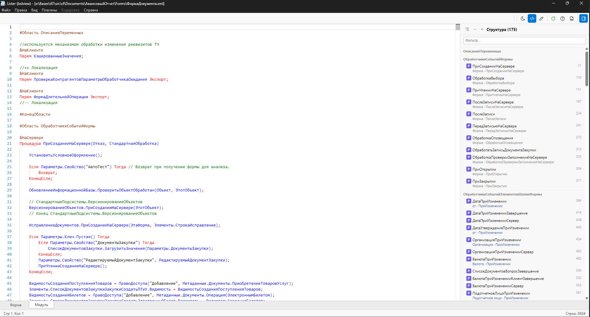
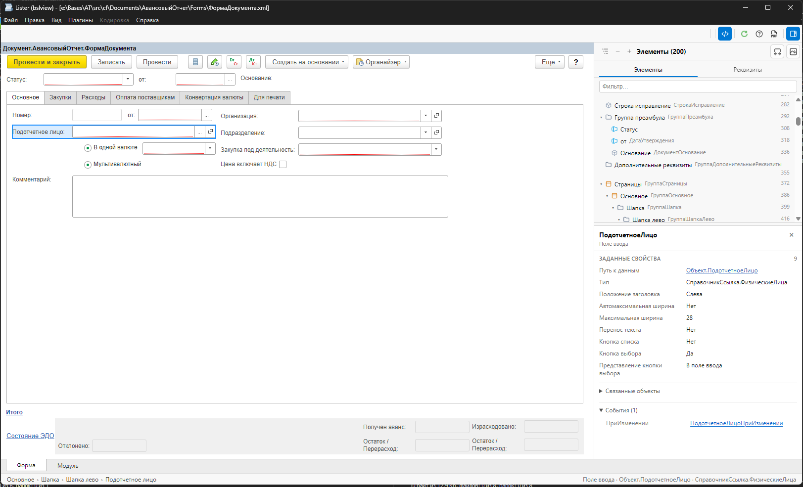
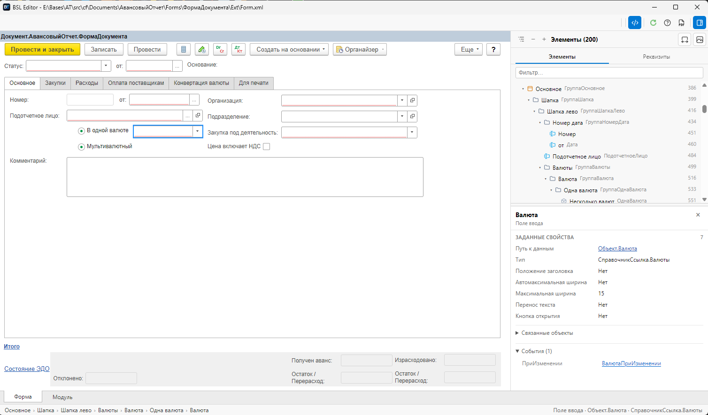
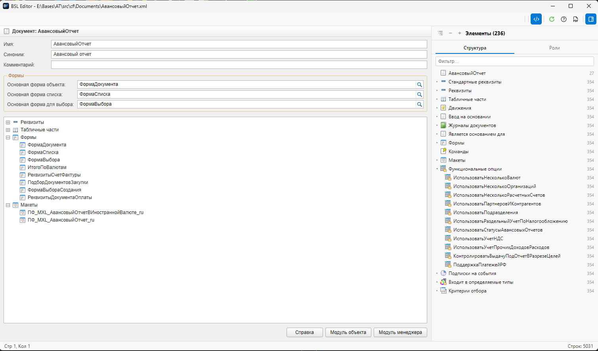
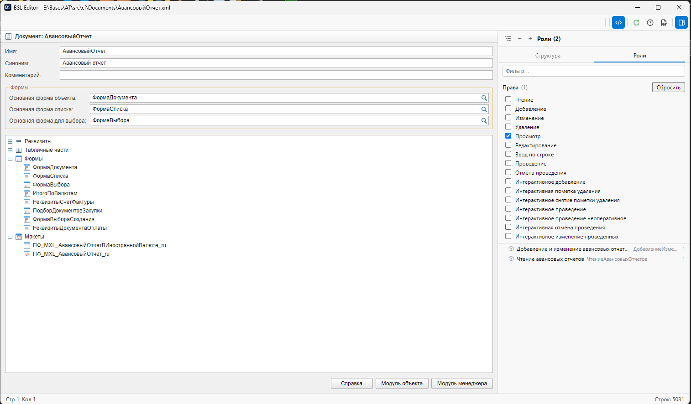
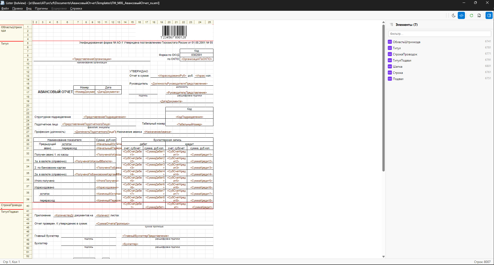
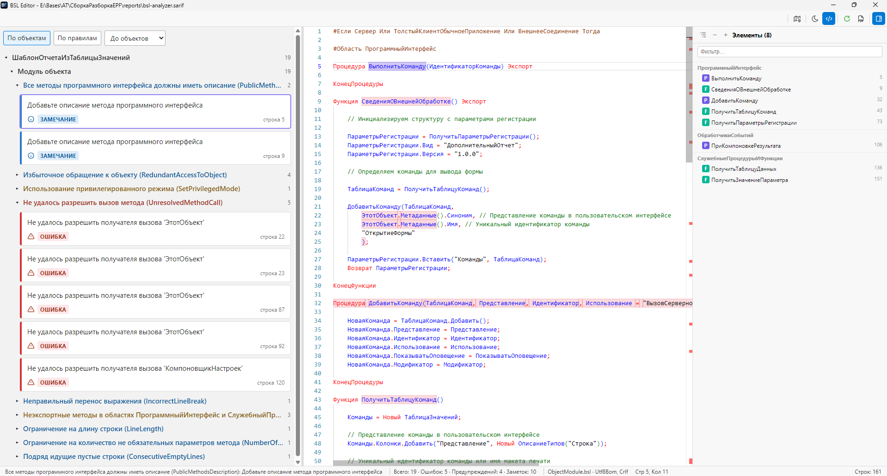

# BSLView — плагин Total Commander

BSLView открывает файлы 1С по F3 прямо в Total Commander: модули с подсветкой
как в конфигураторе, запросы, формы и макеты в визуальном виде, отчёты проверок
кода SARIF, объекты метаданных как окно объекта в конфигураторе. Интернет и
установленная 1С не нужны.

Внутри — редактор Monaco (движок VS Code) в WebView2. Тот же интерфейс работает
в автономном редакторе [BSLEdit](bsledit.md), поэтому всё описанное ниже
относится к обоим инструментам.



## Установка

1. Скачайте `BSLView.zip` со страницы [Releases](https://github.com/alonehobo/BslEdit/releases).
2. Откройте архив в Total Commander — установка предложится автоматически.

Нужен WebView2 Runtime (в Windows 10/11 он обычно уже есть). Без него плагин
откатывается на упрощённую подсветку через Internet Explorer.

<details>
<summary>Ручная установка</summary>

1. Скопируйте в `%COMMANDER_PATH%\plugins\wlx\BSLView\` файлы `BSLView.wlx`,
   `BSLView.wlx64`, `BSLView.ini` и папку `web` целиком.
2. Total Commander → Конфигурация → Настройка → Плагины → Lister (WLX) →
   «Добавить» → выберите `BSLView.wlx64` (или `BSLView.wlx` для 32-bit).

Если другой lister-плагин уже перехватывает те же расширения, поднимите BSLView
выше в списке плагинов.
</details>

## Модули и запросы

- Подсветка BSL и OneScript (`.bsl`, `.os`) в цветах конфигуратора, русский и
  английский синтаксис.
- Отдельная подсветка языка запросов (`.sdbl`, `.query`) и текста запроса внутри
  модуля.
- Панель «Структура» справа: процедуры и функции, группировка по `#Область`,
  фильтр, сортировка, свернуть/развернуть всё.
- Карта кода, нумерация строк, сворачивание блоков.
- Светлая и тёмная тема: по умолчанию светлая, кнопка на панели инструментов
  переключает тему, выбор запоминается.
- Кодировка определяется автоматически (UTF-8 с BOM и без, UTF-16, Windows-1251)
  и сохраняется при записи.

## Редактирование

| Действие | Клавиши |
|---|---|
| Включить/выключить правку | `Ctrl+E` |
| Сохранить | `Ctrl+S` |
| Форматировать модуль | `Alt+Shift+F` |
| Закомментировать строку | `Ctrl+/` |

При выходе из режима правки плагин спросит, сохранить ли изменения; отказ
перечитывает файл с диска.

**Безопасное сохранение.** Если файл изменился на диске, пока вы его правили,
сохранение не перезапишет чужие изменения — появится предупреждение «Файл
изменён извне».

## Markdown, JSON, XML

Markdown открывается в два окна: исходник слева, готовый текст справа. Активная
строка и выделение подсвечиваются в обеих панелях. JSON, XML, PowerShell и HTML
показываются с подсветкой.

## Формы 1С

`Form.xml` из выгрузки конфигурации показывается так, как форма выглядит в
конфигураторе: командные панели с кнопкой «Еще», группы, вкладки, поля, таблицы,
картинки. Раскладка выверена на десятках реальных форм.

Если форма лежит внутри выгрузки конфигурации, плагин подтягивает метаданные
объекта, общие команды, картинки и элементы стиля — поэтому типы, ширины полей и
команды совпадают с платформой. Можно открыть и описатель `Forms/Имя.xml` —
плагин сам найдёт `Ext/Form.xml`.



### Инспектор элемента

Щелчок по элементу на форме или в дереве справа выделяет его и открывает
инспектор:

- свойства элемента с русскими названиями;
- тип данных (`СправочникСсылка.Номенклатура`, `Число(15, 2)` и т. п.);
- путь к данным — ссылкой на реквизит формы;
- события — ссылками на обработчики в модуле формы.



### Форма и модуль

Если рядом с формой есть `Ext/Form/Module.bsl`, внизу появляются вкладки
**Форма** и **Модуль**, как в конфигураторе. В структуре модуля у каждой
процедуры видно, какому элементу формы она назначена обработчиком, — щелчок
ведёт к этому элементу. F3 на самом `Module.bsl` тоже открывает всю форму —
сразу на вкладке **Модуль**.

В режиме правки модуль редактируется прямо на вкладке. «Сохранить» (Ctrl+S)
записывает всё, что изменилось, — `Form.xml`, `Module.bsl` или оба файла;
при закрытии несохранённая правка любого из них вызывает вопрос о сохранении.

### Поиск по форме

Фильтр в структуре ищет по именам, заголовкам и путям к данным. Найденные
элементы показываются плоским списком с полным путём («Страницы › Товары ›
Сумма») и счётчиком «N из M».

### Вписать и сохранить

- «Вписать по ширине» уменьшает широкую форму под размер окна.
- «Сохранить снимок формы в PNG» сохраняет форму целиком, даже если она не
  помещается на экране.

## Объекты метаданных

XML объекта из выгрузки конфигурации (например, `Documents/АвансовыйОтчет.xml`),
а также внешней обработки или отчёта открывается как окно объекта в
конфигураторе: имя, синоним, комментарий, основные формы и дерево реквизитов,
табличных частей, форм и макетов с типами.

- Двойной щелчок по форме, макету или модулю открывает его в том же окне;
  кнопка «Назад» и `Alt+←` возвращают к объекту.
- Панель «Структура» справа показывает всё, что связано с объектом:
  стандартные реквизиты, команды, движения, ввод на основании, а также
  обратные связи — регистраторы, журналы, подсистемы, функциональные опции,
  подписки на события, определяемые типы, критерии отбора. Двойной щелчок
  открывает связанный объект.
- Инспектор показывает свойства выбранного узла, тип — с квалификаторами.
- «Справка» открывает справку объекта (`Ext/Help`), если она есть.

Связи ищутся по всей выгрузке, поэтому для внешних обработок и файлов вне
выгрузки их нет.



### Роли

Закладка «Роли» рядом со «Структурой» показывает роли, которые дают права на
объект. Флажки сверху фильтруют роли по правам («Чтение», «Изменение»,
«Проведение»…), «Сбросить» снимает фильтр; выбор сохраняется между объектами.
Права с ограничением доступа на уровне записей отмечены. Первый поиск по
большой конфигурации занимает несколько секунд, дальше — мгновенно.



## Макеты и табличные документы

`Template.xml` и `.mxl` (8.x) показываются сеткой, как в редакторе макета:
именованные области, параметры `<Имя>`, объединения, рамки, картинки. Щелчок по
области в дереве подсвечивает её в макете. Бинарный MOXCEL 1С 7.7 не
поддерживается.



## Отчёты SARIF

Отчёты проверок кода в формате SARIF 2.1.0 (например, от bsl ls и
bsl-analyzer) открываются как дерево замечаний:

- группировка «По объектам» или «По правилам»;
- русские названия правил и уровни «Ошибка», «Предупреждение», «Замечание»;
- модули подписаны по-русски («Модуль объекта», «Модуль менеджера»…);
- быстрое раскрытие до объектов, модулей, правил или отдельных диагностик;
- щелчок по замечанию открывает строку модуля;
- большие отчёты подгружаются частями и не подвешивают окно.



## Настройка

Настройки лежат в `BSLView.ini` рядом с плагином.

```ini
[Options]
FontFamily=Consolas, Courier New, monospace
FontSize=14
TabSize=4
LineNumbers=1
UseMonaco=1      ; 0 — упрощённая подсветка через IE
MaxFileSizeMB=64 ; файлы крупнее открываются встроенным просмотрщиком
KeepWarm=1       ; держать редактор загруженным между файлами

[Extensions]
BSLExtensions=bsl;os
QueryExtensions=sdbl;query
TextExtensions=md;markdown;json;xml;ps1;psm1;psd1;html;htm;mxl;sarif
```

`KeepWarm=1` — главный параметр скорости: F3 открывает файл примерно за
полсекунды вместо нескольких секунд ценой ~150 МБ памяти. Поставьте `0`, если
память важнее.

Новое расширение из `[Extensions]` начинает работать после перезапуска Total
Commander. Total Commander запоминает список расширений при установке плагина:
если после правки `[Extensions]` файл не открывается, переустановите плагин.
