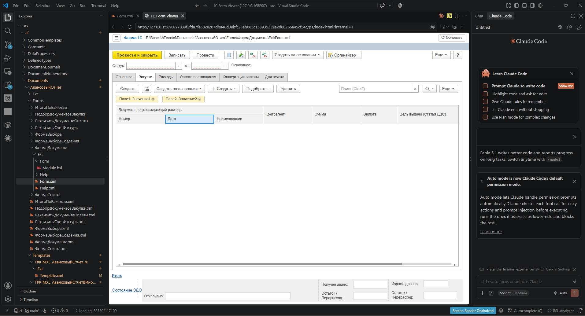
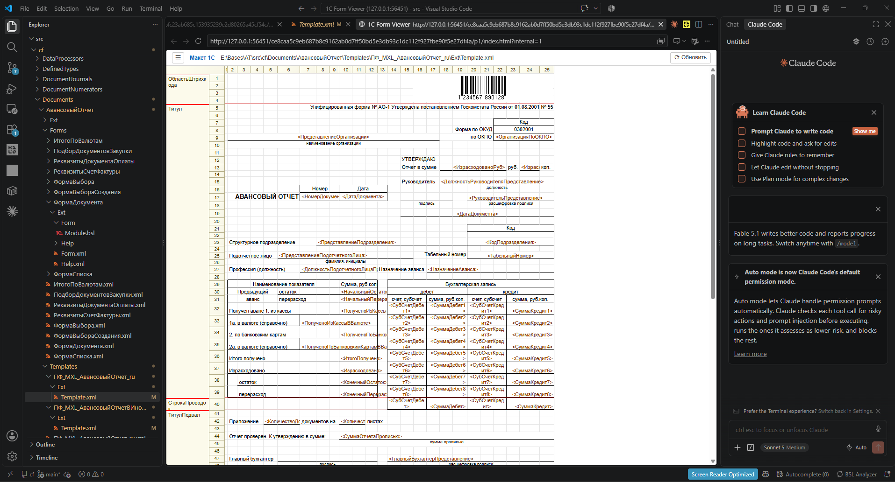

# 1C Form Viewer для VS Code

Расширение показывает формы 1С (`Form.xml`), макеты (`Template.xml`) и
табличные документы `.mxl` рядом с исходником — так, как они выглядят в
конфигураторе. В него встроен [MCP-сервер](mcp.md), поэтому VS Code Chat умеет
смотреть на формы, делать снимки, править управляемые формы и собирать макеты
печатных форм из Excel.



## Установка

В VS Code: Extensions (`Ctrl+Shift+X`) → найдите **1C Form Viewer** от
`alonehobo` → Install. Или из командной строки:

```powershell
code --install-extension alonehobo.1c-form-viewer-vscode
```

Можно установить и файл `.vsix` со страницы
[Releases](https://github.com/alonehobo/BslEdit/releases): Extensions → `…` →
Install from VSIX.

Требования: Windows, VS Code 1.101 или новее. Node.js не нужен.

## Превью формы и макета

1. Откройте `.xml` или `.mxl`.
2. Нажмите **1C Preview** в строке состояния или кнопку превью в заголовке
   редактора. Команда **1C: Open Visual Preview** есть также в Command Palette
   и контекстном меню файла.

Превью открывается во встроенном браузере VS Code:

- дерево элементов слева — щелчок подсвечивает элемент и прокручивает к нему;
- кнопка `☰` прячет дерево, когда форме нужна вся ширина;
- после сохранения файла превью обновляется само.

Превью только показывает файл и ничего в нём не меняет.



## VS Code Chat

Встроенный сервер регистрируется автоматически — ничего настраивать не нужно.

1. Откройте папку с выгрузкой конфигурации.
2. Выполните **MCP: List Servers** → **1C Form Viewer** и при первом запуске
   подтвердите доверие к локальному серверу.
3. В Chat (режим Agent) попросите, например: «Покажи, как выглядит форма
   документа РеализацияТоваровУслуг. Не открывай XML».

Что умеет агент — просмотр форм, снимки, правка форм, конвертация Excel в макет
и правка макетов — подробно описано в [описании MCP-сервера](mcp.md).

## Claude Code, Codex, Cursor и другие агенты

Другие агенты (Claude Code, Codex, Cline, Cursor и т. п.) не читают список
MCP-серверов VS Code. Для них расширение публикует тот же сервер по постоянному
адресу — скачивать отдельный `exe` и указывать путь не нужно, после обновления
расширения настройка не ломается:

```
http://127.0.0.1:47391/mcp
```

Claude Code (терминал VS Code):

```powershell
claude mcp add --transport http --scope user one-c-form-viewer http://127.0.0.1:47391/mcp
```

Cursor, Cline и другие клиенты с форматом `mcpServers`:

```json
{
  "mcpServers": {
    "one-c-form-viewer": { "type": "http", "url": "http://127.0.0.1:47391/mcp" }
  }
}
```

Codex (`~/.codex/config.toml`):

```toml
[mcp_servers.one_c_form_viewer]
url = "http://127.0.0.1:47391/mcp"
```

Что нужно знать:

- адрес доступен, пока открыт VS Code с расширением; если окон несколько, порт
  занимает первое;
- превью открывается во вкладке VS Code;
- сервер принимает запросы только с этого компьютера, без токена, и может читать
  поддерживаемые файлы в любой папке — `--root` не нужен;
- если порт занят, это видно в **Output → 1C Form Viewer**; смените порт
  настройкой `1cFormViewer.mcp.http.port` и тот же номер укажите в агенте.

Если агент должен работать без запущенного VS Code, подключите отдельный сервер
по инструкции из [описания MCP](mcp.md#подключение).

## Настройки

| Настройка | По умолчанию | Назначение |
|---|---|---|
| `1cFormViewer.mcp.enabled` | `true` | Регистрировать MCP-сервер для Chat |
| `1cFormViewer.mcp.templateEditTools` | `true` | Разрешить агенту править макеты. При выключении просмотр, конвертация и проверка остаются |
| `1cFormViewer.mcp.formEditTools` | `true` | Разрешить агенту править формы. При выключении просмотр, список элементов и проверка формы остаются |
| `1cFormViewer.mcp.additionalRoots` | `[]` | Дополнительные папки, которые может читать сервер |
| `1cFormViewer.mcp.allowAnyPath` | `false` | Разрешить любые папки |
| `1cFormViewer.mcp.http.enabled` | `true` | Публиковать сервер по HTTP для других агентов |
| `1cFormViewer.mcp.http.port` | `47391` | Порт HTTP-адреса `http://127.0.0.1:<порт>/mcp` |

По умолчанию сервер для Chat работает только с папками открытого workspace. Если
выгрузка лежит в другом месте, добавьте её:

```json
{
  "1cFormViewer.mcp.additionalRoots": ["D:\\1C\\MyConfiguration"]
}
```

После изменения настроек перезапустите сервер: **MCP: List Servers** →
**1C Form Viewer** → **Restart**.

## Ограничения

- Поддерживаются `.xml` и `.mxl`. Отчёты SARIF, инспектор элементов и вкладка
  «Модуль» есть только в [BSLView](bslview.md) и [BSLEdit](bsledit.md).
- Только Windows.
